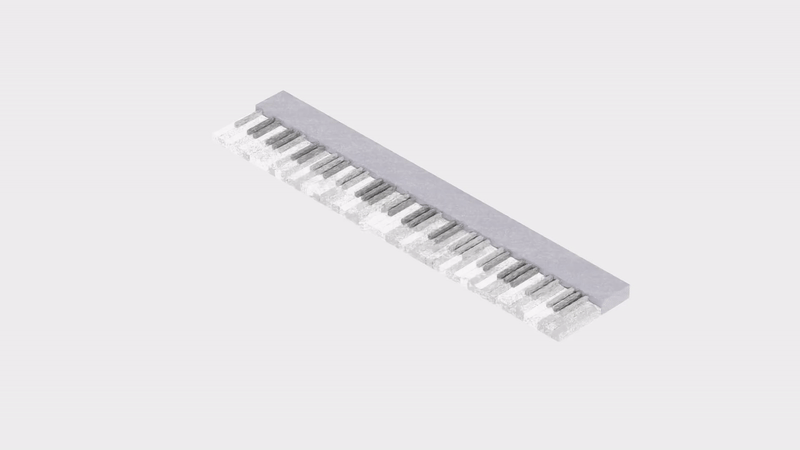
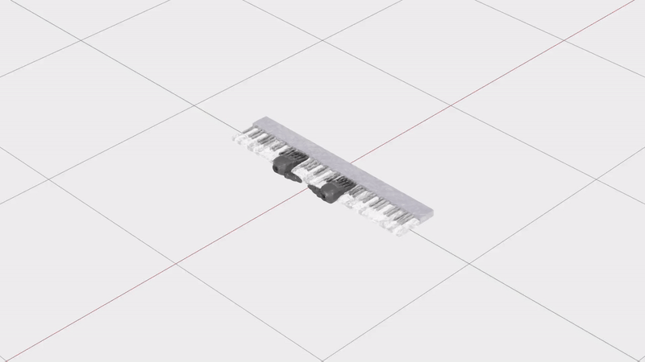

```
/home/skr/isaacsim/python.sh demo_midi_playback.py
```

midi_playback_latest.mp4 

file used to generate latest track

```
 python self_actuated_piano_env.py --file TwinkleTwinkleRousseau
```

```
python piano_with_shadow_hands_env.py --env_name RoboPianist-debug-TwinkleTwinkleLittleStar-v0
```


/home/skr/Downloads/piano/piano_with_allegro_hands.usda

